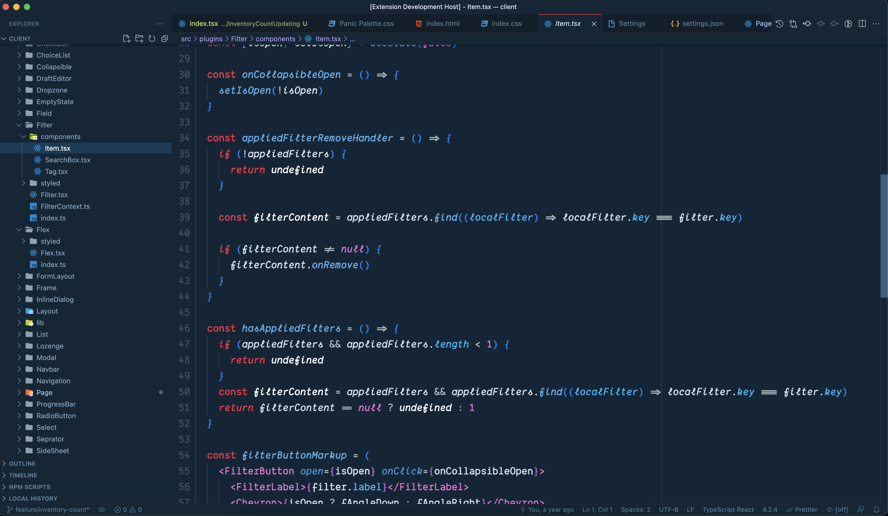
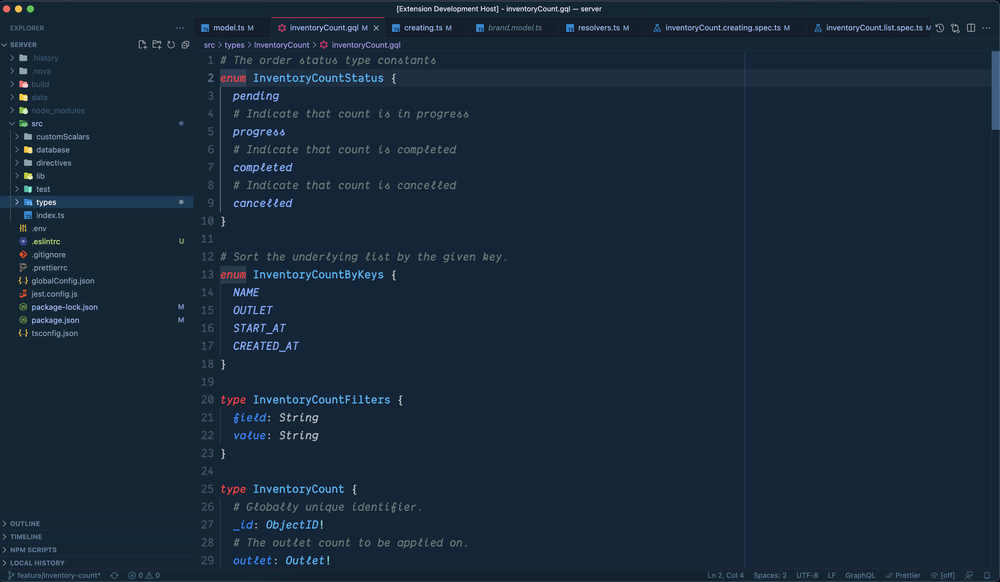
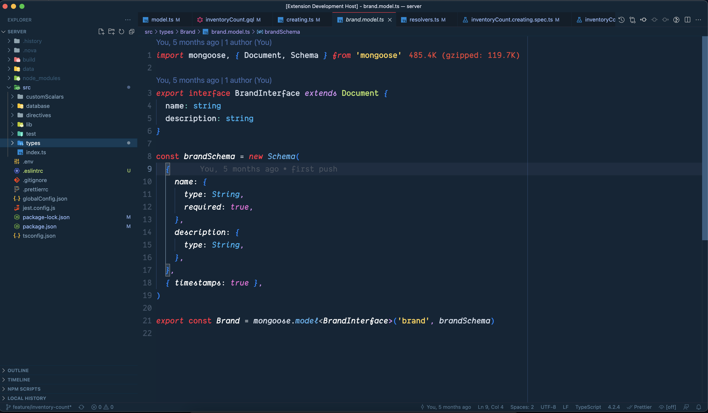

# Visual Studio Code Palette

Inspired by the palette nova theme, this is a lovely dark theme for contemporary
displays. The Palette color space is used in the visual studio code palette
theme. The brightness of each color in the palette was chosen with care. This
offers your editor a feeling of order and hierarchy. The color scheme achieves
the ideal blend of soft pastels and sharp contrast. The colors follow a harmonic
pattern and span the full spectrum.

## Visual Studio Code Palette

 
 

# Installation

1.  Install [Visual Studio Code](https://code.visualstudio.com/)
2.  Launch Visual Studio Code
3.  Choose **Extensions** from menu
4.  Search for `Palette`
5.  Click **Install** to install it
6.  Click **Reload** to reload the Code
7.  From the menu bar click: Code > Preferences > Color Theme > **Palette**
